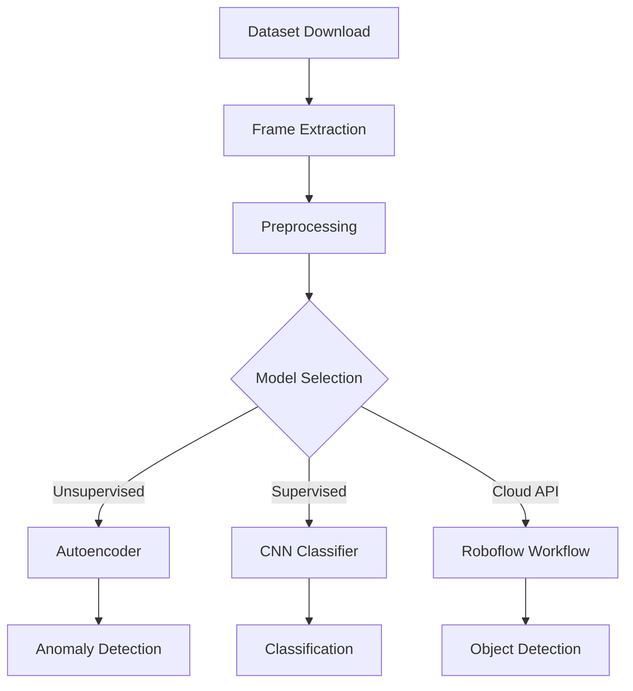
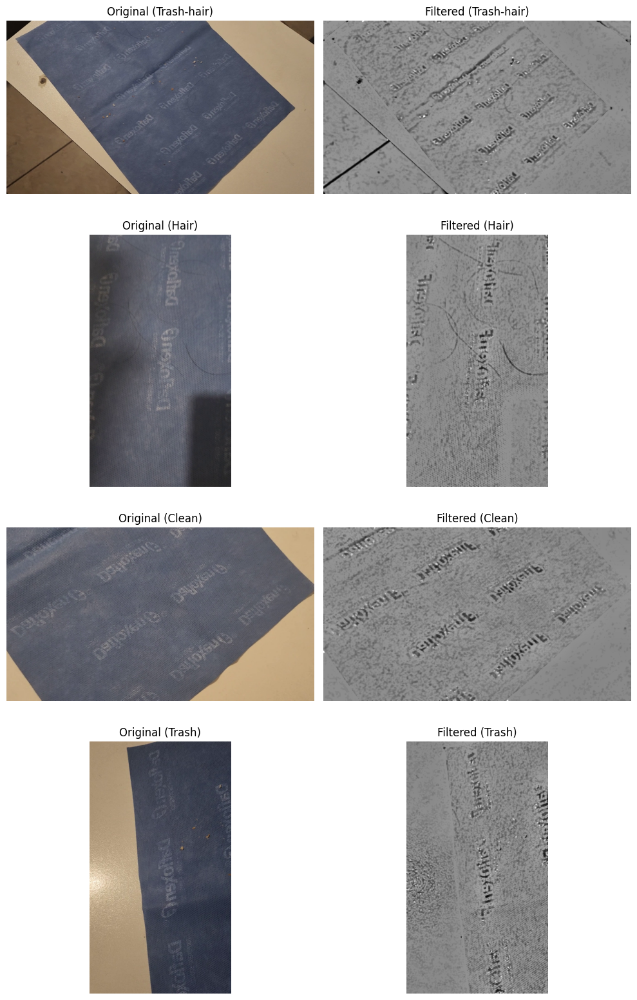
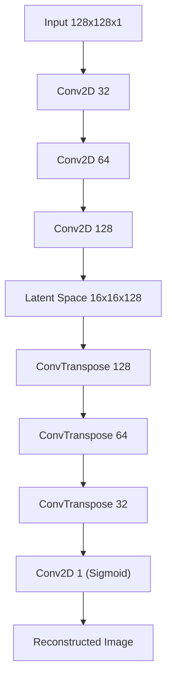
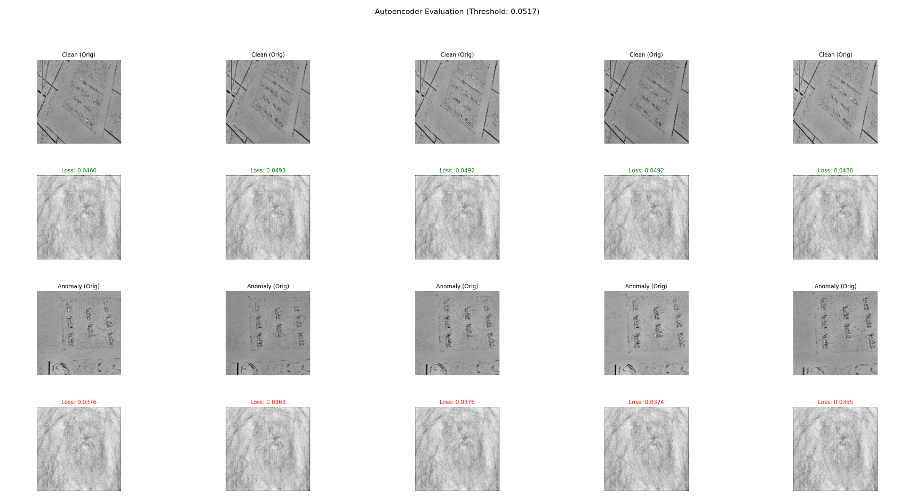
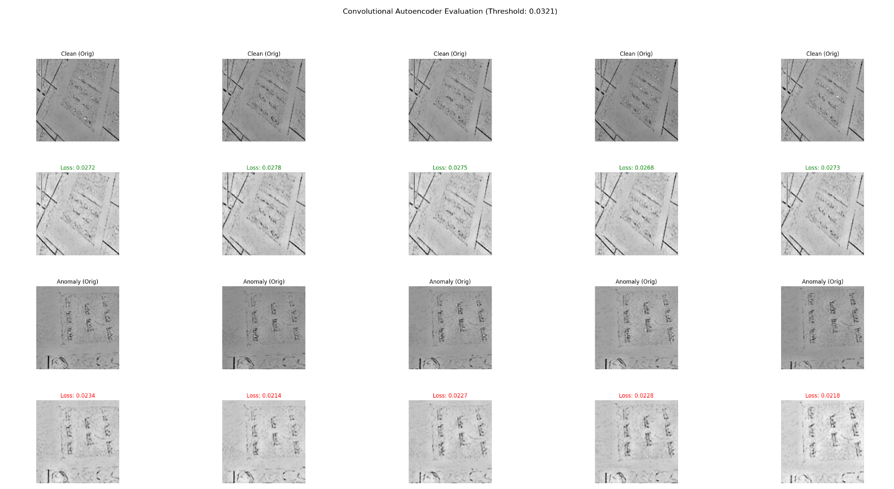
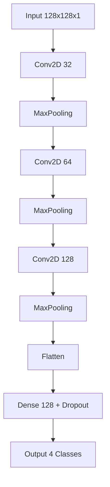
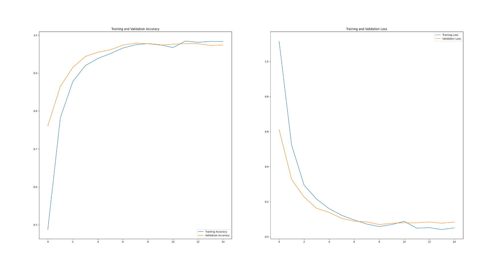
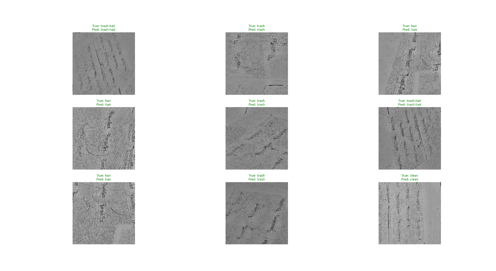
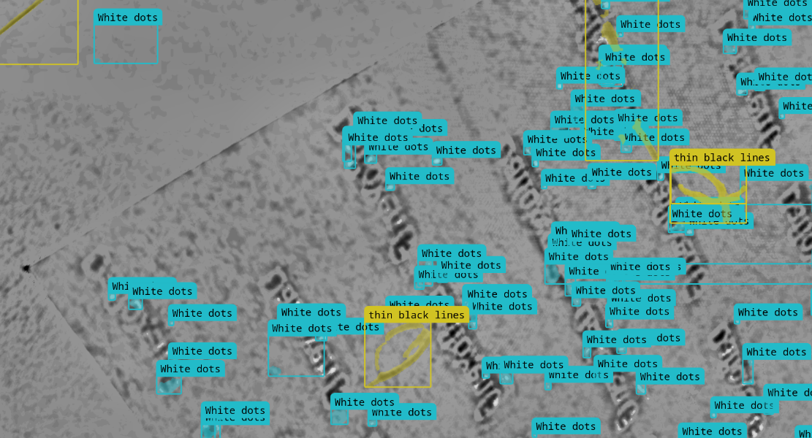

# Sterile-Field Micro-Contaminant Detector (SF-MCD)

This project implements an AI system to detect micro-contaminants (hair and trash) on a sterile field (tablecloth). It explores multiple approaches including Autoencoders for anomaly detection, a CNN Classifier, and a Roboflow workflow.

## Project Pipeline



## 1. Dataset & Preprocessing

The dataset consists of video frames extracted from recordings of sterile fields.

- **Download**: Videos are downloaded from Google Drive.
- **Extraction**: Frames are extracted at regular intervals.
- **Preprocessing**:

  - **TopHat Morphological Operation**: We use morphological TopHat transforms to isolate small, bright elements (crumbs) and dark elements (hair) from the background.
  - **Noise Filtering**: A size-based threshold is applied to the TopHat result. Small blobs are kept as potential contaminants, while larger blobs (like logos or text on the sterile field) are masked out.
  - **Contrast Enhancement**: The isolated features are recombined with a neutral background to create high-contrast images for the models.

  ```mermaid
  graph LR
      A[Input Image] --> B[Morphological TopHat]
      B --> C{Size Thresholding}
      C -->|Small Area| D["Keep (Crumbs/Hair)"]
      C -->|Large Area| E["Remove (Logos/Noise)"]
      D --> F[Contrast Enhancement]
      F --> G[Output Image]
  ```

  
  _Figure: Comparison of original images vs. preprocessed (filtered) images._

## 2. Models & Results

### A. Autoencoder (Anomaly Detection)

The autoencoder is trained exclusively on "clean" sterile field images to learn the normal texture. When it encounters an anomaly (hair or trash), it fails to reconstruct it accurately, resulting in a high reconstruction error (MSE). We set a threshold based on the training loss; any image exceeding this error is flagged as contaminated.




_Figure: Initial Autoencoder reconstruction showing input vs. output._

**Initial Autoencoder Results:**

- **Mean Loss**: 0.0402 | **Std Dev**: 0.0057
- **Anomaly Threshold**: 0.0517
- **Performance**:
  - Clean: 100% (Specificity)
  - Hair: 62% (Recall)
  - Trash: 18% (Recall)
  - Trash-Hair: 0% (Recall)

**Improved Autoencoder Results:**


_Figure: Improved Autoencoder reconstruction._

- **Mean Loss**: 0.0253 | **Std Dev**: 0.0045
- **Anomaly Threshold**: 0.0321
- **Performance**:
  - Clean: 100%
  - Hair: 81%
  - Trash: 51%
  - Trash-Hair: 6%

### B. CNN Classifier (Supervised Learning)

We trained a custom Convolutional Neural Network (CNN) to classify 128x128 grayscale images into four specific categories: **Clean, Hair, Trash, and Trash-Hair**.

**Model Architecture:**
The model uses a standard architecture for image classification:

1.  **Convolutional Blocks**: Three blocks of Conv2D layers (32, 64, 128 filters) to extract spatial features (edges, textures), followed by MaxPooling to reduce dimensionality.
2.  **Dense Layers**: A fully connected layer (128 units) to interpret features, with Dropout (0.5) to prevent overfitting.
3.  **Output**: A Softmax layer for the 4 classes.



**Training Results (15 Epochs):**

- **Training Accuracy**: ~98.3%
- **Validation Accuracy**: ~97.4%
- **Loss**: Low (0.05 - 0.08)


_Figure: Training and Validation Accuracy/Loss over epochs._


_Figure: Sample predictions on the validation set._

### C. Roboflow-Rapid (SAM-Powered)

We utilized Roboflow's rapid workflow tools, which leverage the **Segment Anything Model (SAM)** in the backend. This approach allows for zero-shot detection by simply prompting the model with text descriptions of the targets.

For our case, we used the prompts:

- **"White dots"**: To identify small trash or crumbs.
- **"Thin black lines"**: To identify hair strands.

This method avoids the need for training a custom model from scratch, relying instead on SAM's ability to understand geometric and visual concepts from text.


_Figure: Example of detection using Roboflow workflow._

**Evaluation Results (Last 100 images per class):**

- **Clean**:
  - Avg White Dots: 0.00
  - Avg Black Lines: 1.13
- **Hair**:
  - Avg White Dots: 0.00
  - Avg Black Lines: 0.03
- **Trash**:
  - Avg White Dots: 1.65
  - Avg Black Lines: 0.65
- **Trash-Hair**:
  - Avg White Dots: 0.00
  - Avg Black Lines: 1.70

**Observations:**

- **Trash Detection**: The model successfully detects "White dots" in the Trash class (Avg 1.65) compared to Clean/Hair (0.00).
- **Hair Detection**: The "Thin black lines" detection is inconsistent. While "Trash-Hair" shows the highest count (1.70), the pure "Hair" class shows very few (0.03), and surprisingly, "Clean" images show some false positives (1.13). This suggests the "Thin black lines" prompt or model might need refinement to distinguish actual hair from background artifacts.

## Usage

### Prerequisites

- Python 3.x
- Install dependencies: `pip install -r requirements.txt`

### Running the Pipeline

1. **Download & Build Dataset**:
   ```bash
   python dataset/dataset_builder.py
   ```
2. **Apply Filters**:
   ```bash
   python filtering/apply_filters-template_matching.py
   ```
3. **Train Classifier**:
   ```bash
   python cnn/cnn-classifier.py
   ```

## Notebook

A complete Jupyter Notebook `Sterile-Field-Micro-Contaminant-Detector.ipynb` is provided to run the entire pipeline in Google Colab or locally.
